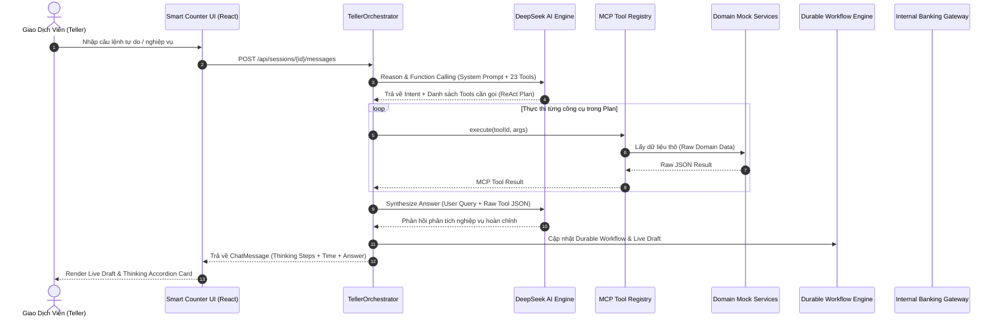

# Kiến Trúc Hệ Thống B.Smart Teller Copilot (Architecture Specification)

## 1. Tổng Quan Kiến Trúc (Architecture Overview)

Hệ thống **B.Smart Teller Copilot** được thiết kế theo nguyên lý **Tự chủ có kiểm soát (Bounded Autonomy)** dành riêng cho môi trường giao dịch quầy ngân hàng, đảm bảo tính tuân thủ pháp lý, an toàn dữ liệu và tối ưu hiệu suất thao tác của Giao dịch viên (GDV).

```
                      +------------------------------------------+
                      |         Smart Counter Web Client         |
                      |   (React 19 + TypeScript + Vite Hub)     |
                      +--------------------+---------------------+
                                           | HTTP / REST / SSE
                                           v
+-----------------------------------------------------------------------------------+
|                        B.Smart Teller Backend Core (Spring Boot)                 |
|                                                                                   |
|  +-----------------------------------------------------------------------------+  |
|  |             Hybrid Reasoning & Orchestration Layer                          |  |
|  |                                                                             |  |
|  |  +---------------------------+       +-----------------------------------+  |  |
|  |  |    DeepSeek AI Client     | <---> |   Rule-Based Reasoning Engine     |  |  |
|  |  | (Function Calling + R1)   |       |   (Deterministic Slot-Filling)    |  |  |
|  |  +---------------------------+       +-----------------------------------+  |  |
|  |                              \       /                                      |  |
|  |                               v     v                                       |  |
|  |                   [ Autonomous ReAct Planner ]                              |  |
|  |                                |                                            |  |
|  |                                v                                            |  |
|  |                   [ Reasoning Synthesis Engine ]                            |  |
|  |             (Tự động tính toán số liệu thô từ MCP Tools)                    |  |
|  +--------------------------------+--------------------------------------------+  |
|                                   |                                               |
|  +--------------------------------v--------------------------------------------+  |
|  |                     McpServer & McpToolRegistry                             |  |
|  |                   (23 Chuẩn Hóa Banking Capabilities)                       |  |
|  +--------------------------------+--------------------------------------------+  |
|                                   |                                               |
|  +--------------------------------v--------------------------------------------+  |
|  |               Decoupled Domain Mock Services Layer                          |  |
|  |  - MockCustomerProfileService     - MockCreditScoreService                  |  |
|  |  - MockAccountService             - MockNextBestOfferService                |  |
|  |  - MockTransactionStatementService- MockSavingsAdvisorService               |  |
|  |  - MockCustomerPersonaService     - MockCardService                         |  |
|  |                           - MockMarketDirectoryService                      |  |
|  +--------------------------------+--------------------------------------------+  |
|                                   |                                               |
|  +--------------------------------v--------------------------------------------+  |
|  |               Temporal-style Durable Workflow Engine                        |  |
|  |  (State Machine · Maker-Checker Signals · Event Sourcing Audit)            |  |
|  +--------------------------------+--------------------------------------------+  |
|                                   |                                               |
|  +--------------------------------v--------------------------------------------+  |
|  |                Internal Banking Core API Gateway                            |  |
|  |  (Idempotency Ledger Enforce · traceId Injection · Financial Write Gate)   |  |
|  +--------------------------------+--------------------------------------------+  |
+-----------------------------------|-----------------------------------------------+
                                    v
                     +-----------------------------+
                     |    SQLite Durable Storage   |
                     | (`data/teller_workflows.db`)|
                     +-----------------------------+
```

---

## 2. Các Thành Phần Trọng Yếu

### 2.1. Hybrid Reasoning & Dynamic Autonomous Engine
- **DeepSeek AI Function Calling**: Tiếp nhận ngôn ngữ tự nhiên tự do của GDV, tự động đối chiếu ngữ cảnh phiên làm việc (`customerRef`, `counterId`, `accountNumber`) và lập kế hoạch ReAct gồm 1 đến 4 bước gọi công cụ MCP phù hợp.
- **Reasoning Synthesis**: Các công cụ MCP trả về dữ liệu thô (Raw JSON records). DeepSeek LLM tự động tổng hợp, duyệt từng dòng giao dịch và tính toán số liệu thống kê (Inflow/Outflow, giao dịch lớn nhất, điểm tín nhiệm...) thay vì tính cứng trong API.
- **Rule-Based Engine**: Đảm bảo hệ thống 100% uptime và zero-downtime khi mất kết nối mạng bên ngoài.

### 2.2. Hệ Sinh Thái 23 MCP Banking Tools
Tất cả các năng lực ngân hàng đều tuân thủ chuẩn **Model Context Protocol (JSON-RPC 2.0)**:
1. **Khách hàng & Định danh (CIF):** `customer.profile.read`, `customer.accounts.list`, `customer.accounts.summary`.
2. **Chân dung 360 & Tín dụng:** `customer.persona.analytics`, `customer.credit.score.check`, `recommendation.nbo.products`.
3. **Sao kê & Tiền gửi:** `statement.transaction.history` (10-30 giao dịch ngẫu nhiên), `savings.product.advisor`.
4. **Dịch vụ Thẻ:** `card.service.manage`.
5. **Thị trường & Tra cứu:** `fx.rate.lookup`, `branch.directory.lookup`, `bank.directory.lookup`, `pricing.transfer.fee`, `knowledge.policy.search`.
6. **Kiểm soát & AML:** `transfer.limit.check`, `cash.limit.check`, `risk.transfer.screen`, `risk.cash.screen`, `transaction.draft.validate`, `cash.draft.validate`, `account.resolve.by_number`.
7. **Hạch toán Tài chính:** `core.transfer.execute`, `core.cash.execute`.

### 2.3. Hệ Thống 8 Domain Mock Services Phân Tách (Decoupled)
Kiến trúc tách nhỏ `MockBankingDataService` thành các service đơn nhiệm:
- [`MockCustomerProfileService`](file:///Users/giangbh/Documents/DNSE/teller-agent-poc/src/main/java/com/dnse/teller/mock/MockCustomerProfileService.java): Quản lý profile, CCCD, nghề nghiệp, phân khúc (`STANDARD`, `GOLD`, `PRIORITY`, `DIAMOND_VIP`).
- [`MockAccountService`](file:///Users/giangbh/Documents/DNSE/teller-agent-poc/src/main/java/com/dnse/teller/mock/MockAccountService.java): Quản lý tài khoản thanh toán, tiền gửi kỳ hạn, tổng tài sản AUM.
- [`MockTransactionStatementService`](file:///Users/giangbh/Documents/DNSE/teller-agent-poc/src/main/java/com/dnse/teller/mock/MockTransactionStatementService.java): Sinh 10-30 giao dịch ngẫu nhiên sinh động không tính sẵn để LLM tự tính toán.
- [`MockCustomerPersonaService`](file:///Users/giangbh/Documents/DNSE/teller-agent-poc/src/main/java/com/dnse/teller/mock/MockCustomerPersonaService.java): Phân tích khẩu vị đầu tư, gắn bó, tần suất giao dịch hàng tháng.
- [`MockCreditScoreService`](file:///Users/giangbh/Documents/DNSE/teller-agent-poc/src/main/java/com/dnse/teller/mock/MockCreditScoreService.java): Chấm điểm tín dụng CIC (680-820), xếp hạng tín nhiệm, hạn mức vay/thấu chi trước.
- [`MockNextBestOfferService`](file:///Users/giangbh/Documents/DNSE/teller-agent-poc/src/main/java/com/dnse/teller/mock/MockNextBestOfferService.java): Đề xuất gói sản phẩm ưu đãi NBO.
- [`MockSavingsAdvisorService`](file:///Users/giangbh/Documents/DNSE/teller-agent-poc/src/main/java/com/dnse/teller/mock/MockSavingsAdvisorService.java): Tính toán lãi suất tiền gửi và tối ưu kỳ hạn tiết kiệm.
- [`MockCardService`](file:///Users/giangbh/Documents/DNSE/teller-agent-poc/src/main/java/com/dnse/teller/mock/MockCardService.java): Quản trị thẻ ATM, Debit Napas, Credit Visa/Mastercard.
- [`MockMarketDirectoryService`](file:///Users/giangbh/Documents/DNSE/teller-agent-poc/src/main/java/com/dnse/teller/mock/MockMarketDirectoryService.java): Tỷ giá 10 ngoại tệ và mạng lưới chi nhánh toàn quốc.

### 2.4. Temporal-style Durable Workflow Engine & Maker-Checker
- Trạng thái phiên làm việc (`INIT` $\rightarrow$ `DRAFT_GENERATED` $\rightarrow$ `PENDING_APPROVAL` $\rightarrow$ `APPROVED` $\rightarrow$ `POSTED`) được quản lý bằng Event Sourcing bất biến.
- Các giao dịch trên hạn mức quầy (50 triệu VND chuyển khoản hoặc 100 triệu VND nộp/rút tiền mặt) bắt buộc kích hoạt cổng phê duyệt **Maker-Checker (Kiểm soát viên 4 mắt)** trước khi chuyển tiếp sang tầng hạch toán Core.

---

## 3. Quy Trình Xử Lý Yêu Cầu (End-to-End Execution Flow)


