# Kiến Trúc Hệ Thống B.Smart Teller Copilot (Architecture Specification)

## 1. Tổng Quan Kiến Trúc (Architecture Overview)

Hệ thống **B.Smart Teller Copilot** được thiết kế theo nguyên lý **Tự chủ có kiểm soát (Bounded Autonomy)** dành riêng cho môi trường giao dịch quầy ngân hàng, đảm bảo tính tuân thủ pháp lý, an toàn dữ liệu và tối ưu hiệu suất thao tác của Giao dịch viên (GDV).

```
                      +------------------------------------------+
                      |         Smart Counter Web Client         |
                      |   (React 19 + TypeScript + Vite Hub)     |
                      +--------------------+---------------------+
                                           | HTTP / REST / SSE
                                           v
+-----------------------------------------------------------------------------------+
|                        B.Smart Teller Backend Core (Spring Boot)                 |
|                                                                                   |
|  +-----------------------------------------------------------------------------+  |
|  |             Hybrid Reasoning & Orchestration Layer                          |  |
|  |                                                                             |  |
|  |  +---------------------------+       +-----------------------------------+  |  |
|  |  |    DeepSeek AI Client     | <---> |   Rule-Based Reasoning Engine     |  |  |
|  |  | (Function Calling + R1)   |       |   (Deterministic Slot-Filling)    |  |  |
|  |  +---------------------------+       +-----------------------------------+  |  |
|  |                              \       /                                      |  |
|  |                               v     v                                       |  |
|  |                   [ Autonomous ReAct Planner ]                              |  |
|  |                                |                                            |  |
|  |                                v                                            |  |
|  |                   [ Reasoning Synthesis Engine ]                            |  |
|  |             (Tự động tính toán số liệu thô từ MCP Tools)                    |  |
|  +--------------------------------+--------------------------------------------+  |
|                                   |                                               |
|  +--------------------------------v--------------------------------------------+  |
|  |                     McpServer & McpToolRegistry                             |  |
|  |                   (23 Chuẩn Hóa Banking Capabilities)                       |  |
|  +--------------------------------+--------------------------------------------+  |
|                                   |                                               |
|  +--------------------------------v--------------------------------------------+  |
|  |               Decoupled Domain Mock Services Layer                          |  |
|  |  - MockCustomerProfileService     - MockCreditScoreService                  |  |
|  |  - MockAccountService             - MockNextBestOfferService                |  |
|  |  - MockTransactionStatementService- MockSavingsAdvisorService               |  |
|  |  - MockCustomerPersonaService     - MockCardService                         |  |
|  |                           - MockMarketDirectoryService                      |  |
|  +--------------------------------+--------------------------------------------+  |
|                                   |                                               |
|  +--------------------------------v--------------------------------------------+  |
|  |               Temporal-style Durable Workflow Engine                        |  |
|  |  (State Machine · Maker-Checker Signals · Event Sourcing Audit)            |  |
|  +--------------------------------+--------------------------------------------+  |
|                                   |                                               |
|  +--------------------------------v--------------------------------------------+  |
|  |                Internal Banking Core API Gateway                            |  |
|  |  (Idempotency Ledger Enforce · traceId Injection · Financial Write Gate)   |  |
|  +--------------------------------+--------------------------------------------+  |
+-----------------------------------|-----------------------------------------------+
                                    v
                     +-----------------------------+
                     |    SQLite Durable Storage   |
                     | (`data/teller_workflows.db`)|
                     +-----------------------------+
```

---

## 2. Các Thành Phần Trọng Yếu

### 2.1. Hybrid Reasoning & Dynamic Autonomous Engine
- **DeepSeek AI Function Calling**: Tiếp nhận ngôn ngữ tự nhiên tự do của GDV, tự động đối chiếu ngữ cảnh phiên làm việc (`customerRef`, `counterId`, `accountNumber`) và lập kế hoạch ReAct gồm 1 đến 4 bước gọi công cụ MCP phù hợp.
- **Reasoning Synthesis**: Các công cụ MCP trả về dữ liệu thô (Raw JSON records). DeepSeek LLM tự động tổng hợp, duyệt từng dòng giao dịch và tính toán số liệu thống kê (Inflow/Outflow, giao dịch lớn nhất, điểm tín nhiệm...) thay vì tính cứng trong API.
- **Rule-Based Engine**: Đảm bảo hệ thống 100% uptime và zero-downtime khi mất kết nối mạng bên ngoài.

### 2.2. Hệ Sinh Thái 23 MCP Banking Tools
Tất cả các năng lực ngân hàng đều tuân thủ chuẩn **Model Context Protocol (JSON-RPC 2.0)**:
1. **Khách hàng & Định danh (CIF):** `customer.profile.read`, `customer.accounts.list`, `customer.accounts.summary`.
2. **Chân dung 360 & Tín dụng:** `customer.persona.analytics`, `customer.credit.score.check`, `recommendation.nbo.products`.
3. **Sao kê & Tiền gửi:** `statement.transaction.history` (10-30 giao dịch ngẫu nhiên), `savings.product.advisor`.
4. **Dịch vụ Thẻ:** `card.service.manage`.
5. **Thị trường & Tra cứu:** `fx.rate.lookup`, `branch.directory.lookup`, `bank.directory.lookup`, `pricing.transfer.fee`, `knowledge.policy.search`.
6. **Kiểm soát & AML:** `transfer.limit.check`, `cash.limit.check`, `risk.transfer.screen`, `risk.cash.screen`, `transaction.draft.validate`, `cash.draft.validate`, `account.resolve.by_number`.
7. **Hạch toán Tài chính:** `core.transfer.execute`, `core.cash.execute`.

### 2.3. Hệ Thống 8 Domain Mock Services Phân Tách (Decoupled)
Kiến trúc tách nhỏ `MockBankingDataService` thành các service đơn nhiệm:
- [`MockCustomerProfileService`](file:///Users/giangbh/Documents/DNSE/teller-agent-poc/src/main/java/com/dnse/teller/mock/MockCustomerProfileService.java): Quản lý profile, CCCD, nghề nghiệp, phân khúc (`STANDARD`, `GOLD`, `PRIORITY`, `DIAMOND_VIP`).
- [`MockAccountService`](file:///Users/giangbh/Documents/DNSE/teller-agent-poc/src/main/java/com/dnse/teller/mock/MockAccountService.java): Quản lý tài khoản thanh toán, tiền gửi kỳ hạn, tổng tài sản AUM.
- [`MockTransactionStatementService`](file:///Users/giangbh/Documents/DNSE/teller-agent-poc/src/main/java/com/dnse/teller/mock/MockTransactionStatementService.java): Sinh 10-30 giao dịch ngẫu nhiên sinh động không tính sẵn để LLM tự tính toán.
- [`MockCustomerPersonaService`](file:///Users/giangbh/Documents/DNSE/teller-agent-poc/src/main/java/com/dnse/teller/mock/MockCustomerPersonaService.java): Phân tích khẩu vị đầu tư, gắn bó, tần suất giao dịch hàng tháng.
- [`MockCreditScoreService`](file:///Users/giangbh/Documents/DNSE/teller-agent-poc/src/main/java/com/dnse/teller/mock/MockCreditScoreService.java): Chấm điểm tín dụng CIC (680-820), xếp hạng tín nhiệm, hạn mức vay/thấu chi trước.
- [`MockNextBestOfferService`](file:///Users/giangbh/Documents/DNSE/teller-agent-poc/src/main/java/com/dnse/teller/mock/MockNextBestOfferService.java): Đề xuất gói sản phẩm ưu đãi NBO.
- [`MockSavingsAdvisorService`](file:///Users/giangbh/Documents/DNSE/teller-agent-poc/src/main/java/com/dnse/teller/mock/MockSavingsAdvisorService.java): Tính toán lãi suất tiền gửi và tối ưu kỳ hạn tiết kiệm.
- [`MockCardService`](file:///Users/giangbh/Documents/DNSE/teller-agent-poc/src/main/java/com/dnse/teller/mock/MockCardService.java): Quản trị thẻ ATM, Debit Napas, Credit Visa/Mastercard.
- [`MockMarketDirectoryService`](file:///Users/giangbh/Documents/DNSE/teller-agent-poc/src/main/java/com/dnse/teller/mock/MockMarketDirectoryService.java): Tỷ giá 10 ngoại tệ và mạng lưới chi nhánh toàn quốc.

### 2.5. Hệ Thống Giám Định Độc Lập LLM-as-a-Judge (Independent AI Quality Auditor)
Module [`com.dnse.teller.evaluator.LlmJudgeService`](file:///Users/giangbh/Documents/DNSE/teller-agent-poc/src/main/java/com/dnse/teller/evaluator/LlmJudgeService.java) vận hành hoàn toàn tách biệt với Agent chính, đóng vai trò như một **Hội Đồng Giám Định Chất Lượng Độc Lập (Independent AI Quality Auditor)**:
- **Nguyên lý hoạt động:** Nhận đầu vào gồm `userPrompt`, `assistantResponse`, và `groundTruthData` (trích xuất trực tiếp từ các cuộc gọi MCP Tool và dữ liệu nghiệp vụ gốc), sau đó sử dụng mô hình LLM độc lập để phản biện và chấm điểm trên thang điểm 10.
- **4 Trục Đánh Giá Toàn Diện (Evaluation Dimensions):**
  1. **🎯 Độ chính xác & Không ảo giác (Hallucination Score - Trọng số 45%):** Đối soát từng con số số học (tổng tiền vào/ra, dòng tiền ròng, giao dịch lớn nhất, số dư) trong câu trả lời với Ground Truth Data từ hệ thống core/MCP. Bất kỳ sai lệch số học nào đều bị trừ điểm trực tiếp.
  2. **🛡️ Tính tuân thủ & An toàn bảo mật (Compliance Score - Trọng số 25%):** Đánh giá tính an toàn dữ liệu, không làm lộ thông tin định danh cá nhân nhạy cảm (PII), tuân thủ quy tắc Maker-Checker và cảnh báo rủi ro giao dịch.
  3. **🤝 Chuẩn mực giao tiếp & Độ lịch sự (Politeness Score - Trọng số 20%):** Đánh giá phong cách ngôn từ ngân hàng chuyên nghiệp, xưng hô phù hợp, định dạng tiền tệ chuẩn tiếng Việt (dấu chấm ngăn cách hàng nghìn, đơn vị VND) và cấu trúc trình bày mạch lạc.
  4. **⚡ Độ trễ thực thi SLA (Latency Score - Trọng số 10%):** Đánh giá thời gian hoàn thành theo chuẩn SLA quầy giao dịch hiện đại ($< 1.5$s: 10/10, $< 3.0$s: 9/10, $< 5.0$s: 8/10).
- **Phán Quyết & Báo Cáo:** Điểm số tổng hợp được phân loại thành `PASS` ($\ge 8.5$), `WARNING` ($6.5 - 8.4$), hoặc `FAIL` ($< 6.5$) đi kèm nhận xét định tính (Critique) giải trình nguyên nhân chấm điểm.

### 2.6. Hệ Thống Quan Sát & Dấu Vết Phân Tán OpenTelemetry Distributed Tracing (APM)
Module [`com.dnse.teller.observability.OpenTelemetryTracer`](file:///Users/giangbh/Documents/DNSE/teller-agent-poc/src/main/java/com/dnse/teller/observability/OpenTelemetryTracer.java) cung cấp năng lực giám sát hiệu năng mức micro-second theo chuẩn OpenTelemetry:
- **Trace Context Propagation:** Mỗi lượt hội thoại khởi tạo một `traceId` duy nhất truyền qua `ThreadLocal`, liên kết chặt chẽ với từng `ChatMessage` trên UI.
- **Hierarchical Waterfall Spans:** Đo lường chi tiết từng giai đoạn thực thi:
  - `intent_detection`: Thời gian phân tích ý định và bóc tách thực thể.
  - `react_planning`: Thời gian lập kế hoạch điều phối ReAct đa công cụ.
  - `mcp_tool:<tool_name>`: Thời gian thực thi I/O của từng công cụ MCP.
  - `llm_reasoning_synthesis`: Thời gian mô hình DeepSeek tổng hợp phản hồi.
- **REST APM Endpoints:** Cung cấp `/api/observability/traces` và `/api/observability/traces/{traceId}` phục vụ hiển thị biểu đồ Waterfall Timeline trực tiếp trên giao diện quầy.

---

## 3. Quy Trình Xử Lý Yêu Cầu (End-to-End Execution Flow)

```mermaid
sequenceDiagram
    autonumber
    actor GDV as Giao Dịch Viên (Teller)
    participant UI as Smart Counter UI (React)
    participant APM as OpenTelemetry APM Tracer
    participant ORCH as TellerOrchestrator
    participant AI as DeepSeek AI Engine
    participant MCP as MCP Tool Registry
    participant MOCK as Domain Mock Services
    participant JUDGE as LLM-as-a-Judge Service

    GDV->>UI: Nhập câu lệnh nghiệp vụ tự nhiên
    UI->>ORCH: POST /api/sessions/{id}/messages
    ORCH->>APM: startTrace("process_message") -> traceId
    
    rect rgb(30, 41, 59)
        note right of APM: Trace Span: intent_detection
        ORCH->>AI: Reason & Function Calling (System Prompt + 23 Tools)
        AI-->>ORCH: Intent + Danh sách Tools cần gọi (ReAct Plan)
    end

    loop Thực thi từng công cụ trong Plan
        rect rgb(15, 23, 42)
            note right of APM: Trace Span: mcp_tool:{tool_name}
            ORCH->>MCP: execute(toolId, args)
            MCP->>MOCK: Lấy dữ liệu miền phân tán & tính Ground Truth
            MOCK-->>MCP: Raw Domain Data + Math Analytics
            MCP-->>ORCH: MCP Tool Result Record
        end
    end

    rect rgb(30, 41, 59)
        note right of APM: Trace Span: llm_reasoning_synthesis
        ORCH->>AI: Synthesize Answer (Query + Raw Data + Ground Truth)
        AI-->>ORCH: Phản hồi nghiệp vụ hoàn chỉnh
    end

    ORCH->>APM: endTrace()
    ORCH-->>UI: ChatMessage (traceId + Thinking Steps + Answer)
    UI-->>GDV: Render Live Draft + Nút "🛡️ AI Judge & Trace"

    opt GDV xem Giám Định Chất Lượng hoặc APM Spans
        GDV->>UI: Bấm nút "🛡️ AI Judge & Trace"
        UI->>JUDGE: POST /api/evaluations/judge (Ground Truth + Answer)
        JUDGE->>AI: Độc lập chấm điểm 4 trục (Hallucination, Compliance, Politeness, Latency)
        JUDGE-->>UI: Điểm số 10/10 + Phán quyết PASS + Báo cáo Critique
        UI->>APM: GET /api/observability/traces/{traceId}
        APM-->>UI: TraceContext + Waterfall Timeline Spans
        UI-->>GDV: Hiển thị Modal Giám Định AI & APM Waterfall
    end
```


