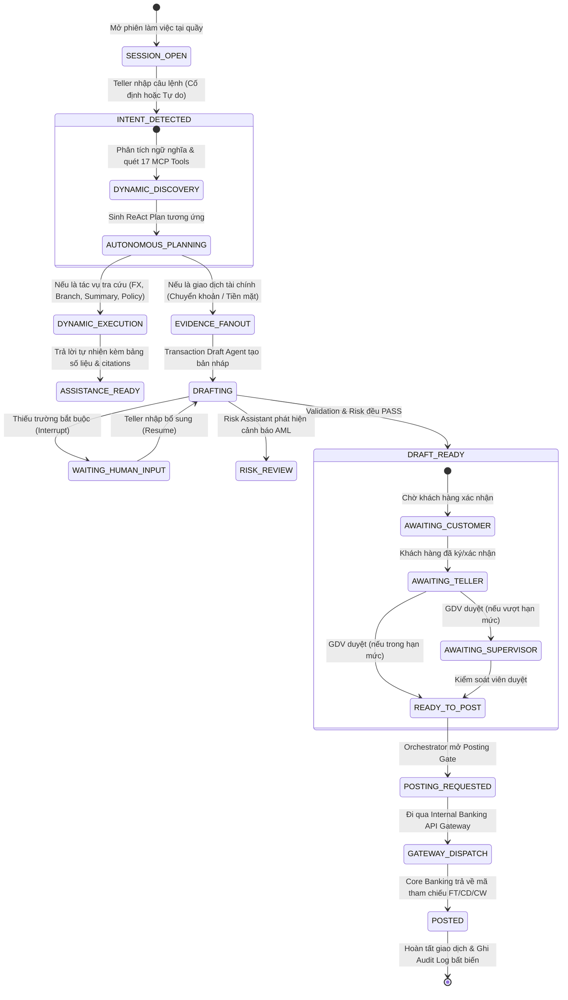

# B.Smart Teller Copilot — Tài Liệu Kiến Trúc Hệ Thống (System Architecture Document)

---

## 1. Tổng Quan & Bối Cảnh Nghiệp Vụ (Executive Summary)

### 1.1. Bối cảnh
Tại các quầy giao dịch ngân hàng truyền thống (Branch Counters), giao dịch viên (Teller) phải thao tác qua nhiều hệ thống phân tán: phần mềm Core Banking, hệ thống tra cứu thông tin khách hàng (CIF), bảng tra cứu biểu phí, văn bản quy trình nghiệp vụ, tỷ giá ngoại tệ và hệ thống rà soát rủi ro/AML. Việc chuyển đổi thủ công giữa các màn hình làm tăng thời gian phục vụ khách hàng (AHT - Average Handling Time) và tiềm ẩn nguy cơ sai sót dữ liệu.

**B.Smart Teller Copilot** được thiết kế nhằm giải quyết bài toán trên thông qua việc ứng dụng **Trợ lý AI Agent tại quầy**, cho phép giao dịch viên tương tác bằng ngôn ngữ tự nhiên, tự động trích xuất thông tin, đối chiếu dữ liệu khách hàng, tra soát biểu phí/quy chế/tỷ giá, tự động tìm kiếm công cụ (**Dynamic Tool Discovery**) và tự động điền các biểu mẫu giao dịch (Live Action Draft).

---

### 1.2. Triết lý Thiết kế Cốt lõi: Bounded Autonomy & Dynamic Discovery

Trong lĩnh vực ngân hàng tài chính, rủi ro ảo giác (Hallucination) hoặc Prompt Injection từ mô hình AI có thể dẫn đến hậu quả hạch toán sai lệch. Hệ thống kết hợp giữa **Khả năng tự hành khám phá công cụ (Autonomous Discovery)** và **Ranh giới an toàn tuyệt đối (Bounded Autonomy)**:

```
┌─────────────────────────────────────────────────────────────────────────────┐
│                 DYNAMIC AGENT & AUTONOMOUS RE-ACT BOUNDARY                  │
│                                                                             │
│  [ Teller Prompt ] ──> [ Dynamic Intent & Semantic Discovery ]              │
│                               │                                             │
│                               ▼                                             │
│       [ Autonomous ReAct Planner ] ──> [ Dynamic MCP Tool Chaining ]        │
│                                              │ (Read / Validate Tools)      │
│                                              ▼                              │
│                               ┌─────────────────────────────┐               │
│                               │ 17 MCP Banking Capabilities │               │
│                               │ (CIF, FX, Branch, Limit...) │               │
│                               └──────────────┬──────────────┘               │
└──────────────────────────────────────────────┼──────────────────────────────┘
                                               │ Read Evidence / Action Draft
                                               ▼
┌─────────────────────────────────────────────────────────────────────────────┐
│           BUSINESS ORCHESTRATION & DURABLE CONTROL GATE (TEMPORAL)          │
│                                                                             │
│  [ Evidence Barrier ] ──> [ Live Action Draft ] ──> [ Maker-Checker Gate ]  │
│                                                              │ (Gated)      │
│                                                              ▼              │
│  [ Internal Banking API Gateway ] ──────────────► [ Core Banking Posting ]  │
│    (Trace ID & Idempotency Ledger)                                          │
│                                                                             │
│  [ SQLite Persistent Store (data/teller_workflows.db) ]                     │
│    - sessions | workflow_executions | workflow_history_events | audit_logs  │
└─────────────────────────────────────────────────────────────────────────────┘
```

1. **Dynamic Autonomous Discovery:** Agent có khả năng phân tích câu lệnh tự do của GDV, tự động quét danh mục 17 MCP Tools, tự chọn công cụ khớp nhất (hoặc chuỗi công cụ) để thực thi mà không phụ thuộc vào các kịch bản cứng (fixed workflows).
2. **Bounded Autonomy:** Agent được toàn quyền đọc và phân tích dữ liệu an toàn (`READ_SAFE`, `SENSITIVE_READ`). **Tuyệt đối KHÔNG có quyền tự ý ghi sổ hoặc gọi trực tiếp Core Banking.** Mọi hành vi liên quan đến tài chính (`FINANCIAL_WRITE`) đều bị giữ lại ở mức **Action Draft** và bắt buộc phải qua phê duyệt **Maker-Checker** (Khách hàng $\rightarrow$ GDV $\rightarrow$ KSV).
3. **Durable Execution Engine (Temporal-style):** Toàn bộ trạng thái phiên, sự kiện lịch sử (Event Sourcing) và tín hiệu phê duyệt (Signals) được snapshot vào cơ sở dữ liệu **SQLite (`data/teller_workflows.db`)**, đảm bảo khôi phục 100% khi có sự cố mạng hoặc khởi động lại hệ thống.
4. **Internal Banking API Gateway:** Cổng kiểm soát trung gian quản lý mã truy vết phân tán (`traceId`) và sổ cái chống trùng lặp (`idempotencyKey`).

---

## 2. Kiến Trúc Phân Tầng (Layered Architecture)

Hệ thống được tổ chức thành 5 tầng kiến trúc phân định trách nhiệm rõ ràng:

```
+------------------------------------------------------------------------------------+
|                         1. CLIENT / PRESENTATION LAYER                             |
|  - React 19 + TypeScript + Vite (Port 8799)                                        |
|  - Smart Counter Hub UI (Dark Mode & Glassmorphism)                                 |
|  - Natural Language Chat Assistant with Confidence Meter                           |
|  - Visual Plan & Dynamic Capability Delegation Stepper                             |
|  - Live Action Draft Form (Chuyển khoản, Nộp tiền, Rút tiền)                       |
|  - Policy Citations, Risk Scorecard & Maker-Checker Control Panel                   |
|  - MCP Protocol Explorer (Danh mục 17 Tools & Live JSON-RPC Tester)                |
+------------------------------------------------------------------------------------+
                                      │ REST API / JSON-RPC 2.0
                                      ▼
+------------------------------------------------------------------------------------+
|                      2. BUSINESS ORCHESTRATION LAYER                               |
|  - Java Spring Boot 3.4+ Web Engine (Java 21/23)                                   |
|  - Dynamic Reasoning Engine (Semantic Matching, Intent Detection, ReAct Planner)   |
|  - Agent Suite (CustomerContext, Policy, Draft, Risk, DynamicTool Assistants)      |
|  - Control Gate Evaluator (Draft Valid + Risk Pass + Approvals Checked)            |
+------------------------------------------------------------------------------------+
                                      │ State Checkpoints & Signals
                                      ▼
+------------------------------------------------------------------------------------+
|                   3. TEMPORAL-STYLE DURABLE WORKFLOW ENGINE                        |
|  - Workflow as Code Engine (`WorkflowEngine.java`, `WorkflowExecution.java`)       |
|  - Signals: Tiếp nhận chữ ký số Maker-Checker (`Approval_customer/teller/sup`)    |
|  - Event Sourcing & History Replay: Ghi nhận mọi bước vào `workflow_history_events`|
|  - SQLite Persistent Store (`data/teller_workflows.db`): sessions, executions...   |
+------------------------------------------------------------------------------------+
                                      │ In-Process / Protocol Calls
                                      ▼
+------------------------------------------------------------------------------------+
|                         4. MCP PROTOCOL & SECURITY LAYER                           |
|  - MCP Protocol Dispatcher (JSON-RPC 2.0: initialize, tools/*, resources/*)        |
|  - Security RBAC Policy Guard:                                                     |
|      * Verify Caller Identity (`allowedCallers`)                                   |
|      * Validate Allowed Workflows (`workflows`)                                    |
|      * Enforce Idempotency Key for Financial Write Tools                           |
|      * PII Masking & Data Sanitization (Che 4 số cuối TK/CCCD)                     |
|  - MCP Tool Registry (17 Banking Capabilities) & Resource Providers                |
+------------------------------------------------------------------------------------+
                                      │ Capability Invocations
                                      ▼
+------------------------------------------------------------------------------------+
|                     5. INTERNAL GATEWAY & BANKING CORE LAYER                       |
|  - Internal Banking API Gateway (`InternalApiGateway.java`):                       |
|      * Generate Trace ID (`TRC-xxxxxxxx`)                                          |
|      * Idempotency Ledger Verification & SQLite Audit Log (`audit_logs`)           |
|  - Banking Adapters & Mock Engines:                                                |
|      * CIF & Portfolio: `customer.profile.read`, `customer.accounts.*`             |
|      * Policy & Market: `knowledge.policy.search`, `pricing.*`, `fx.rate.lookup`   |
|      * Directory: `bank.directory.lookup`, `branch.directory.lookup`               |
|      * Limits & AML: `transfer.limit.check`, `risk.*.screen`                       |
|      * Core Posting Gate: `core.transfer.execute`, `core.cash.execute`             |
+------------------------------------------------------------------------------------+
```

---

## 3. Vòng Đời Phiên Giao Dịch & State Machine (Session Lifecycle)



---

## 4. Đặc Tả Giao Thức Model Context Protocol (MCP) & Danh Mục 17 Tools

### 4.1. Các Phương Thức MCP Được Hỗ Trợ
* **`initialize`:** Bắt tay phiên giao thức chuẩn MCP (`2024-11-05`), server id: `bsmart-teller-mcp-server`.
* **`ping`:** Kiểm tra tình trạng hoạt động (Liveness Probe).
* **`tools/list`:** Trả về đầy đủ danh mục **17 banking capabilities** kèm JSON Schema, metadata rủi ro (`risk`) và quyền gọi (`allowedCallers`).
* **`tools/call`:** Tiếp nhận yêu cầu thực thi, tự động kiểm tra bảo mật RBAC, xác thực Idempotency Key, ghi nhận Activity vào Temporal Workflow và trả về kết quả.
* **`resources/list` & `resources/read`:** Cung cấp tài nguyên số về quy chế ngân hàng (`QTTM-2026`, `QTTT-CK-2026`, `BIEUPHI-2026`).

---

## 5. Mô Hình An Toàn & Bảo Mật Dữ Liệu (Security & Threat Model)

### 5.1. Zero Direct Financial Write
* AI Agent chỉ tương tác với các công cụ đọc (`READ_SAFE`, `SENSITIVE_READ`) hoặc công cụ kiểm tra bản nháp (`DRAFT`, `CONTROL_READ`).
* Công cụ hạch toán (`core.transfer.execute`, `core.cash.execute`) có cờ `isSideEffect = true` và **chỉ duy nhất** caller `business_orchestrator` được phép kích hoạt sau khi đã thỏa mãn 100% Control Gates.

### 5.2. Chống Trùng Lặp Giao Dịch Bằng Idempotency Ledger
* Mọi giao dịch tài chính đi qua **Internal API Gateway** bắt buộc phải có `idempotencyKey` gắn liền với `transactionId` của phiên.
* Gateway kiểm tra trong bảng `audit_logs` của SQLite; nếu key đã tồn tại (do gửi lại hoặc retry), hệ thống trả lại kết quả ban đầu mà không tạo thêm bút toán mới.

### 5.3. Bền Vững & Phục Hồi Sau Sự Cố (Crash Recovery)
* Tất cả phiên làm việc và lịch sử workflow được lưu trữ vào file CSDL cục bộ `data/teller_workflows.db`.
* Khi server gặp sự cố hoặc máy quầy khởi động lại, toàn bộ tiến trình được khôi phục chính xác từng bước mà không làm mất dữ liệu của giao dịch viên.
