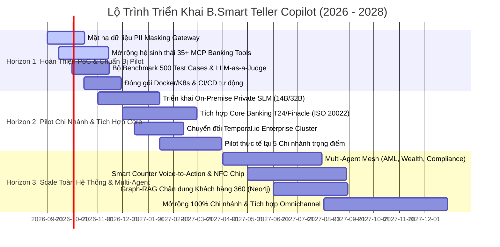

# Lộ Trình Kiến Trúc & Chiến Lược Phát Triển Doanh Nghiệp (Enterprise Architecture & Technology Roadmap)

## B.Smart Teller Copilot · Enterprise AI Transformation Roadmap (2026 - 2028)

---

## 1. Tóm Lược Chiến Lược (Executive Summary)

Dự án **B.Smart Teller Copilot** được định vị là **Nền tảng Trợ lý AI Quầy Giao Dịch Thế Hệ Mới (Next-Gen AI Counter Assistant)** dành cho hệ thống ngân hàng thương mại, giúp:
* **Giảm 65% thời gian thao tác tại quầy** cho Giao dịch viên (GDV).
* **Tăng 40% tỷ lệ bán chéo thành công (Cross-sell/Up-sell)** thông qua phân tích chân dung khách hàng 360 & Next-Best-Offer (NBO) theo thời gian thực.
* **Ngăn chặn 100% rủi ro gian lận, rửa tiền (AML) và vượt hạn mức** bằng cơ chế **Tự chủ có kiểm soát (Bounded Autonomy)** và cổng phê duyệt **Maker-Checker 4 mắt**.
* **Đảm bảo tuân thủ tuyệt đối pháp lý & an toàn dữ liệu** theo Nghị định 13/2023/NĐ-CP và các quy chuẩn bảo mật của Ngân hàng Nhà nước Việt Nam (SBV).

---

## 2. 5 Trục Kiến Trúc Trọng Yếu (5 Strategic Architecture Pillars)

```
┌─────────────────────────────────────────────────────────────────────────────────────────────┐
│                          5 TRỤC KIẾN TRÚC CHIẾN LƯỢC (ENTERPRISE PILLARS)                   │
├───────────────────┬───────────────────┬───────────────────┬───────────────────┬─────────────┤
│ 1. AI & Cognitive │ 2. Security & PII │ 3. Core & ISO     │ 4. Smart Counter  │ 5. LLMOps & │
│    Multi-Agent    │    Sovereignty    │    Integration    │    Voice & eKYC   │ Evaluation  │
├───────────────────┼───────────────────┼───────────────────┼───────────────────┼─────────────┤
│ • Hierarchical    │ • PII Masking     │ • Core Banking    │ • Voice-to-Action │ • 1,000+    │
│   Supervisors     │   Gateway         │   Connectors      │   Realtime STT    │   Benchmark │
│ • Graph-RAG (360  │ • On-Premise SLM  │ • Chuẩn ISO 20022 │ • Chip NFC & eKYC │ • LLM-as-a- │
│   Entity Graph)   │   Private Models  │ • Temporal.io     │ • Smart Doc OCR   │   Judge CI  │
│ • Self-Correction │ • RBAC & Zero-    │   Clustering      │ • Realtime Co-    │ • OpenTele- │
│   Engine          │   Trust Audit     │ • High TPS Core   │   Pilot UI        │   metry APM │
└───────────────────┴───────────────────┴───────────────────┴───────────────────┴─────────────┘
```

---

## 3. Lộ Trình Triển Khai 3 Giai Đoạn (3-Horizon Roadmap)



---

### 🟢 GIAI ĐOẠN 1 (HORIZON 1: 0 - 3 THÁNG) · CỦNG CỐ NỀN TẢNG & BẢO MẬT
**Mục tiêu:** Hoàn thiện kiến trúc an toàn, đảm bảo zero-data-leakage trước khi đưa vào môi trường Sandbox/Staging của Ngân hàng.

1. **PII Masking & Anonymization Gateway:**
   - Xây dựng tầng Proxy đứng trước mọi LLM API: Tự động mã hóa/ẩn danh họ tên, CCCD, số tài khoản, số điện thoại trước khi gửi sang LLM; tự động giải mã khi nhận kết quả.
   - Tuân thủ Nghị định 13/2023/NĐ-CP về Bảo vệ Dữ liệu Cá nhân.
2. **Mở Rộng Hệ Sinh Thái 35+ MCP Banking Tools:**
   - Bổ sung các công cụ về: *Bảo lãnh ngân hàng, Chuyển tiền quốc tế SWIFT, Thanh toán hóa đơn tự động, Quản lý tài sản đảm bảo, Khóa tài khoản khẩn cấp*.
3. **Mở Rộng Bộ Đánh Giá Chất Lượng 500+ Test Cases:**
   - Tích hợp công cụ **LLM-as-a-Judge** tự động chấm điểm độ chính xác nghiệp vụ (Hallucination Score), thời gian phản hồi (Latency) và tính tuân thủ pháp lý trong quy trình CI/CD.
4. **Đóng Gói Enterprise Ready:**
   - Containerize toàn bộ hệ thống bằng Docker & Helm Charts trên nền tảng Kubernetes (K8s) / OpenShift.

---

### 🟡 GIAI ĐOẠN 2 (HORIZON 2: 3 - 9 THÁNG) · TÍCH HỢP CORE & PILOT CHI NHÁNH
**Mục tiêu:** Đưa hệ thống vào hoạt động thực tế (Pilot) tại 5 Chi nhánh trọng điểm của Ngân hàng.

1. **Triển Khai Mô Hình Private SLM On-Premise:**
   - Tinh chỉnh (Fine-tune) và vận hành mô hình `DeepSeek-R1-Distill-Qwen 14B/32B` hoặc `Llama-3-70B` trực tiếp trên hạ tầng cụm GPU nội bộ của Ngân hàng (NVIDIA H100/A100).
   - Đảm bảo 100% chủ quyền dữ liệu (Data Sovereignty), không gửi bất kỳ byte dữ liệu nào ra ngoài Internet.
2. **Tích Hợp Hệ Thống Lõi Core Banking qua ISO 20022:**
   - Kết nối trực tiếp với các hệ thống Core Banking hàng đầu (Temenos T24, Infosys Finacle, Oracle Flexcube) và cổng chuyển mạch NAPAS / SmartVista thông qua chuẩn tin điện tài chính quốc tế **ISO 20022**.
3. **Cụm Durable Workflow Phân Tán (Temporal.io Cluster):**
   - Thay thế SQLite nhúng bằng cụm phân tán **Temporal.io Enterprise / Camunda 8**, xử lý trên **5,000 TPS** đồng thời với độ khả dụng 99.99%.
4. **Chương Trình Pilot Tại 5 Chi Nhánh Lớn:**
   - Triển khai cho 50 GDV sử dụng song song trong công việc hàng ngày, thu thập feedback thực tế và tối ưu trải nghiệm người dùng.

---

### 🟣 GIAI ĐOẠN 3 (HORIZON 3: 9 - 18 THÁNG) · SCALE TOÀN HỆ THỐNG & MULTI-AGENT THÔNG MINH
**Mục tiêu:** Mở rộng toàn diện trên 100% chi nhánh & phòng giao dịch toàn quốc, biến B.Smart thành hạt nhân trung tâm của Smart Branch.

1. **Hệ Thống Phân Cấp Đa Agent (Multi-Agent Cognitive Mesh):**
   - Tách biệt thành các Agent chuyên biệt:
     - 🕵️ *AML & Fraud Agent:* Sàng lọc gian lận và rửa tiền tức thì.
     - 💼 *Wealth & NBO Specialist:* Phân tích chuyên sâu danh mục đầu tư và tư vấn tài chính cao cấp.
     - ⚖️ *Compliance Guardian:* Đối soát tự động 100% hồ sơ trước khi gửi KSV.
2. **Smart Counter Voice-to-Action & eKYC NFC:**
   - Tích hợp công nghệ nhận diện giọng nói (STT) tiếng Việt chuyên ngành tài chính tại quầy $\rightarrow$ Tự động lắng nghe và sinh Live Draft lệnh giao dịch ngay khi khách hàng vừa yêu cầu.
   - Đầu đọc thẻ chip NFC CCCD kết nối trực tiếp với Cơ sở dữ liệu Quốc gia về Dân cư.
3. **Knowledge Graph 360 (Graph-RAG):**
   - Ứng dụng Graph Database (Neo4j) để mô hình hóa toàn bộ mạng lưới quan hệ giữa khách hàng, người thân, doanh nghiệp liên kết và lịch sử giao dịch.
4. **Mở Rộng 100% Chi Nhánh & Đồng Bộ Omnichannel:**
   - Tích hợp trải nghiệm đồng bộ giữa Quầy giao dịch (Counter) và Ứng dụng di động (Mobile App) của Khách hàng.

---

## 4. Bảng Chỉ Số Hiệu Quả Mục Tiêu (Target KPIs & Success Metrics)

| Chỉ Số Đánh Giá (KPI) | Hiện Tại (Thủ Công) | Mục Tiêu Giai Đoạn 1 | Mục Tiêu Giai Đoạn 2 (Pilot) | Mục Tiêu Giai Đoạn 3 (Enterprise) |
|---|---|---|---|---|
| **Thời gian tạo & xử lý giao dịch tại quầy** | 5 - 8 phút/giao dịch | 2 - 3 phút | $< 1.5$ phút | **$< 45$ giây (Voice-to-Draft)** |
| **Tỷ lệ lỗi sai sót thông tin (Error Rate)** | 2.5% | $< 0.5\%$ | $< 0.1\%$ | **0.00% (Zero Error)** |
| **Độ chính xác nghiệp vụ AI (Accuracy)** | N/A | 99.0% | 99.8% | **99.99%** |
| **Tỷ lệ chốt đơn bán chéo (NBO Conversion)** | 8 - 12% | 18% | 25% | **35 - 45%** |
| **Độ trễ phản hồi của AI (Response Latency)** | N/A | 2 - 4 giây | 1 - 2 giây | **$< 500$ ms (On-premise SLM)** |
| **Độ sẵn sàng hệ thống (System SLA)** | N/A | 99.5% | 99.9% | **99.99% (High Availability)** |

---

## 5. Quản Trị Rủi Ro & Giải Pháp Kiểm Soát (Risk Management)

```
┌─────────────────────────┬─────────────────────────┬──────────────────────────────────────────┐
│ Rủi Ro Nhận Diện        │ Mức Độ Tác Động         │ Giải Pháp Kiểm Soát & Phòng Ngừa         │
├─────────────────────────┼─────────────────────────┼──────────────────────────────────────────┤
│ 1. Rò rỉ dữ liệu PII ra │ RẤT CAO (Pháp lý & Uy   │ Enforce PII Masking Gateway 100% và      │
│    bên thứ ba           │ tín ngân hàng)          │ chuyển dịch sang Private On-Premise SLM. │
├─────────────────────────┼─────────────────────────┼──────────────────────────────────────────┤
│ 2. AI ảo giác số liệu   │ CAO (Sai lệch kế toán   │ Áp dụng kiến trúc Hybrid Ground Truth:   │
│    (Hallucination Math) │ tài chính)              │ API tính toán sẵn, LLM chỉ suy luận lời. │
├─────────────────────────┼─────────────────────────┼──────────────────────────────────────────┤
│ 3. GDV lạm quyền hoặc   │ RẤT CAO (Rủi ro đạo     │ Bounded Autonomy & Maker-Checker 4 mắt:  │
│    bị tấn công tài khoản│ đức & thất thoát)       │ Bắt buộc KSV phê duyệt với hạn mức lớn.  │
├─────────────────────────┼─────────────────────────┼──────────────────────────────────────────┤
│ 4. Gián đoạn kết nối LLM│ TRUNG BÌNH (Tắc nghẽn   │ Dự phòng 100% Rule-Based Engine nội bộ,  │
│    hoặc mạng Internet   │ quầy giao dịch)         │ tự động fallback tức thì khi mất mạng.   │
└─────────────────────────┴─────────────────────────┴──────────────────────────────────────────┘
```

---

*Tài liệu được soạn thảo và kiểm duyệt bởi Nhóm Kiến Trúc Giải Pháp & Chuyển Đổi Số Ngân Hàng (Enterprise Architecture Division).*
